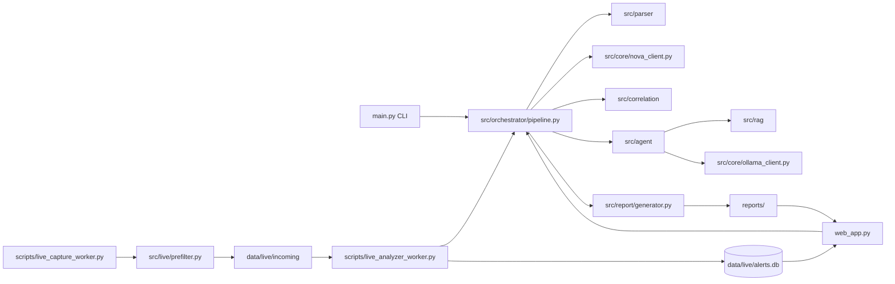

# FlowTragent Architecture

> Updated: 2026-07-16  
> Scope: current repository architecture after phases 1-8 and stage 9 docs work

FlowTragent is an attack tracing and incident analysis system. It combines
traffic parsing, multi-source log enrichment, NOVA-F retrieval, rule-based
correlation, optional RAG/Ollama reasoning, live alerting, evidence graphs, and
report generation.

NOVA-F is treated as a retrieval component, not as the final authority. Final
impact conclusions must still follow FlowTragent evidence grading:

```text
Evidence Observed -> Not Observed -> Confidence Drivers -> Confidence Reducers
```

Retrieval candidates may strengthen CVE relevance, but they cannot directly
promote a case to successful exploitation without supporting evidence.

## System View



## Runtime Entrypoints

| Entrypoint | Role |
|------------|------|
| `main.py` | CLI for payload, PCAP, and live capture modes |
| `web_app.py` | Flask UI, health, metrics, report, alert, and graph endpoints |
| `scripts/live_capture_worker.py` | Long-running capture worker that writes live PCAP segments |
| `scripts/live_analyzer_worker.py` | Polls live segments, applies rate limits, runs deep analysis, stores alerts |
| `scripts/run_web_prod.sh` | Gunicorn-based production-style web launcher |
| `deploy/flowtragent-*.service` | systemd units for web, capture, and analyzer workers |
| `Dockerfile` / `docker-compose.yml` | Container and Compose deployment entrypoints |

## Module Responsibilities

| Module | Responsibility |
|--------|----------------|
| `src/parser/` | PCAP, payload, access/DNS/endpoint/application/Zeek/Suricata log parsing |
| `src/event/models.py` | Shared event and evidence data structures |
| `src/core/settings.py` | Config loading and environment overrides |
| `src/core/nova_client.py` | NOVA-F embedding index loading and vector search |
| `src/core/cve_reranker.py` | CVE candidate reranking, low-similarity suppression, empty-label handling |
| `src/core/structured_logging.py` | JSON Lines audit and operational logging |
| `src/correlation/` | Timeline, attack chain, C2 detection, source tracking, impact analysis, evidence graph |
| `src/agent/` | Agent input schema, orchestration, LangGraph-compatible runner, summary generation |
| `src/rag/` | Optional local knowledge-base context |
| `src/report/generator.py` | JSON, Markdown, localized Markdown, DOT/SVG-ready graph artifacts |
| `src/live/prefilter.py` | Fast live-segment risk scoring before deep analysis |
| `src/storage/alert_store.py` | SQLite alert storage, deduplication, activity grouping, metrics summaries |
| `src/notification/` | Webhook notification payloads, delivery, and suppression fingerprints |

## Analysis Pipeline

The batch and web analysis path follows the same core flow:

```text
input payload / PCAP / logs
  -> parser normalization
  -> NetworkEvent / HttpEvent timeline
  -> NOVA-F candidate retrieval
  -> CVE reranking and suppression
  -> attack-chain and C2 correlation
  -> impact assessment
  -> evidence graph generation
  -> agent summary and optional RAG/Ollama context
  -> JSON / Markdown / DOT report artifacts
```

Important boundaries:

- Parser output should preserve evidence IDs so later stages can cite concrete
  events.
- NOVA-F search results are evidence candidates, not final conclusions.
- Impact assessment downgrades all-4xx traffic unless host-side or application
  evidence supports post-exploitation behavior.
- Endpoint/application evidence can raise confidence only when it has explicit
  confirmation semantics.
- Report generation should expose both observed and missing evidence.

## Live Mode

Live mode is split into a hot path and a deep-analysis path.

Hot path:

```text
tcpdump segment -> prefilter scoring -> incoming queue
```

Deep-analysis path:

```text
incoming queue -> rate limit / stable-file check -> pipeline -> alert store
```

Operational controls:

- Duplicate alerts are merged by fingerprint and occurrence counters.
- Repeated notifications are suppressed by fingerprint windows.
- Cross-window activities are derived from source/destination, time proximity,
  and shared reason families.
- Ollama review is optional and scheduled outside the latency-sensitive capture
  path.

## Web Surface

The Flask app serves both human pages and operational endpoints:

| Endpoint | Purpose |
|----------|---------|
| `GET /` | Workbench and recent reports |
| `GET /alerts` | Alert and attack activity review |
| `GET /health` | JSON health status |
| `GET /metrics` | Prometheus metrics |
| `POST /analyze-payload` | Payload analysis form endpoint |
| `POST /analyze-pcap` | PCAP upload and supplementary-log analysis |
| `GET /view-report/<filename>` | HTML report detail view |
| `GET /reports/<filename>` | Raw report artifact download |
| `POST /delete-report/<filename>` | Delete report artifact set |
| `GET /export-reports.zip` | ZIP export for report artifacts |
| `GET /graph-svg/<filename>` | DOT-to-SVG evidence graph rendering |

Sensitive routes are protected by `FLOWTRAGENT_TOKEN` when configured. See
`docs/API.md` for request details.

## Configuration

Primary configuration lives in `config/config.yaml` and is loaded through
`src/core/settings.py`. Deployment-specific values can be supplied through
environment variables, especially for:

- host, port, workers, and gunicorn timeout;
- report, PCAP, live incoming, and alert database paths;
- NOVA-F index/model paths and retrieval `top_k`;
- live capture interface, segment duration, and prefilter profile;
- structured log path and level;
- webhook notification settings;
- upload size and extension allowlists.

## Data And Artifact Boundaries

Runtime and sensitive artifacts must stay outside source control:

```text
logs/
reports/
data/live/
data/tmp/
data/index/
real PCAP files
raw DataCon datasets
model weights or private embeddings
```

`data/index/` is a generated retrieval artifact. Full-index evaluation should
record index version, source dataset, sample count, excluded holdout IDs, model
path, build command, and generation time.

## Retrieval Evaluation Boundary

The sixth-stage retrieval work is built around a reproducible evaluation loop:

```text
DataCon source -> train/holdout split -> index manifest -> evaluation report
```

Rules:

- holdout samples must not participate in index construction;
- duplicate or near-duplicate train/holdout samples must be removed or clearly
  marked;
- metrics must include Top-1, Top-5, macro CVE Top-5, and failure/root-cause
  summaries;
- quality gates must be explicit when the local dataset is below the planned
  full scale.

## Observability

FlowTragent exposes:

- `/health` for process and path readiness;
- `/metrics` for Prometheus scraping;
- `logs/flowtragent.jsonl` for structured audit events;
- SQLite alert metrics through `AlertStore.metrics_summary()`;
- webhook notification results and suppression counters.

Deployment-specific log rotation is documented in
`docs/FlowTragent_部署指南.md`.

## Extension Points

Preferred extension order:

1. Add mature structured sources first, such as Zeek or Suricata logs.
2. Add lightweight native protocol parsing for high-value cases.
3. Add attack markers only as candidate evidence.
4. Add model tuning only after reproducible evaluation data and quality gates
   are stable.

This keeps FlowTragent auditable while allowing protocol and detection coverage
to grow without weakening the evidence model.
