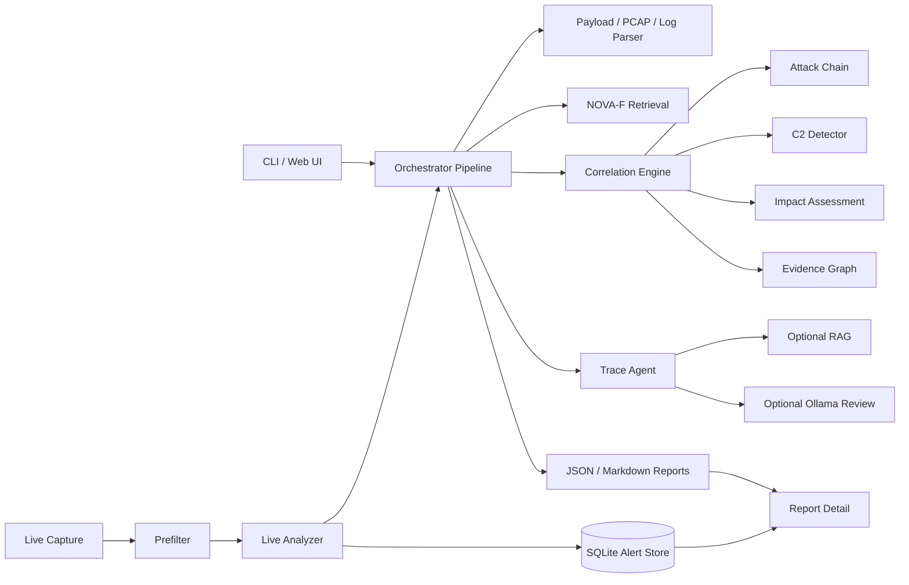
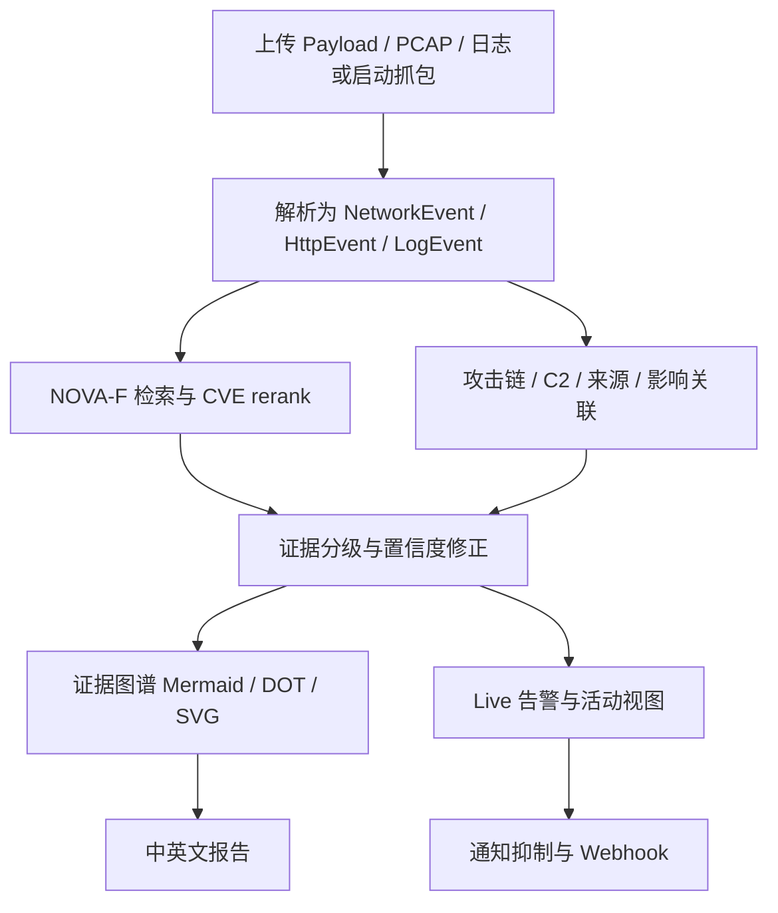

# FlowTragent 产品白皮书

> 更新日期：2026-07-16  
> 定位：攻击流量溯源、应急响应辅助、证据驱动安全研判系统

## 1. 产品定位

FlowTragent 面向靶场、CTF、安全运营和应急响应场景，把 PCAP、payload、Web 日志、DNS 日志、端点日志、Zeek/Suricata 日志等多源证据统一到同一条分析流水线中，输出可追溯的攻击链、CVE 候选、影响判断、C2 迹象、证据图谱和中英文报告。

它不是“给一个 CVE 相似度就下结论”的检索工具，而是一个证据驱动的分析系统：NOVA-F 检索只提供候选 CVE 和相似样本，最终判断必须经过 Evidence Observed、Not Observed、Confidence Drivers、Confidence Reducers 的证据分级。

## 2. 核心价值

| 价值 | 说明 |
|------|------|
| 降低人工流量分析成本 | 自动解析 payload、PCAP 和日志，聚合攻击阶段、来源、目标、C2 行为和报告材料。 |
| 统一多源证据 | 网络侧、应用侧、端点侧证据进入统一事件模型，避免孤立看单条请求。 |
| 降低误判风险 | 4xx、缺失响应、低相似度检索候选不会直接推高“成功利用”结论。 |
| 支持准实时运营 | live capture、prefilter、rate limit、dedup、activity correlation 支持持续告警闭环。 |
| 适合开源协作 | Docker/Compose、systemd、API 文档、架构文档、Issue/PR 模板和贡献指南已具备。 |

## 3. 系统架构

## 4. 使用流程

## 5. 核心技术

### 5.1 统一事件抽象

PCAP、payload 和日志被标准化为 NetworkEvent、HttpEvent、LogEvent 等结构。事件保留时间、源/目的地址、协议、payload、状态码、日志来源和 evidence id，后续攻击链、C2、影响评估和证据图谱都引用同一批证据。

### 5.2 NOVA-F 检索与 CVE rerank

检索层优先读取 FAISS/Numpy 索引和 meta 信息。若本地模型或 faiss 不可用，会回退到 hash embedding / numpy fallback，保证 demo 和部署链路可运行。CVE reranker 结合 CVE 标签投票、payload marker、低相似度抑制和空标签处理，避免非漏洞样本被强行拉向 CVE。

### 5.3 攻击链阶段识别

系统识别 Reconnaissance、Exploitation、Command Execution、Payload Delivery、C2、Persistence、Impact 等阶段。SSRF、XXE、反序列化、模板注入、命令注入等 marker 只作为候选证据，不直接代表成功利用。

### 5.4 C2 与异常行为检测

C2 检测覆盖 HTTP beacon、DNS tunnel、TCP beacon/端口扫描、ICMP 异常。核心指标包括请求次数、时间间隔、jitter、小包比例、长域名、高熵标签、非常见端口和源/目的扩散。

### 5.5 影响判断与证据分级

Impact verdict 不由 CVE 检索单独决定。所有 4xx 响应默认降级为尝试级；只有响应成功、命令执行、文件落地、进程启动、应用确认、外联等证据共同出现时，才提高成功利用置信度。

### 5.6 证据图谱

报告输出 Mermaid、DOT 和 SVG 图谱，把事件、CVE 候选、攻击阶段、C2 endpoint、端点证据和影响判断连接起来，便于复盘和交付。

### 5.7 准实时告警闭环

Live 模式采用“抓包分片 -> 轻量预筛 -> 深度分析 -> 告警入库 -> 活动关联”的设计。prefilter 先用低成本规则评分，rate limit 控制深度分析频率，dedup 合并重复窗口，activity view 关联跨窗口攻击活动。

### 5.8 可观测性与通知

系统提供 `/health`、`/metrics`、JSON Lines 结构化日志、Webhook 通知和 300 秒默认通知抑制窗口。Prometheus 指标覆盖报告、告警、队列、NOVA index ready、通知抑制和数据库大小等运行状态。

## 6. 实测数据

| 验收项 | 结果 | 说明 |
|--------|------|------|
| 单元/集成测试 | 52 passed, 1 skipped | Windows 环境缺少 scapy，真实 ICMP PCAP 解析测试按设计 skipped。 |
| 脚本式测试 | 全部通过 | `test_web_app.py`、`test_agent_orchestrator.py`、`test_langgraph_runner.py`。 |
| Docker Compose | 三服务 healthy | `web`、`analyzer`、`capture` 均可启动。 |
| `/health` | `status: ok` | NOVA index ready，关键路径存在。 |
| `/metrics` | 核心指标可返回 | 包含 PCAP、队列、NOVA、severity 分布等指标。 |
| DataCon demo baseline | 132 samples，Top-5 recall 0.0076 | demo index 只有 4 条记录，只验证评估脚本。 |
| 第六阶段 holdout baseline | 10 samples，Top-5 recall 1.0000，Macro CVE Top-5 recall 1.0000 | holdout 未进入索引构建，但样本规模小，只能作为工程 baseline。 |

限制说明：当前本地 DataCon 训练数据为 5,187 行，索引样本 5,182 条，尚未达到 ≥10,000 样本目标。完整 benchmark 需要更大规模数据源复验。

## 7. 适用场景与边界

适用场景：

- CTF / 靶场攻击流量复盘
- 企业 Web 攻击与可疑回连初筛
- SOC 告警解释与证据补全
- 应急响应报告草稿生成
- 安全研发中的检测规则回归验证

边界：

- 不承诺自动定责、APT 归因或法律取证结论。
- 不自动处置生产资产。
- 模型/检索结果不能绕过证据分级。
- 真实 PCAP、客户日志、DataCon 原始数据和模型权重不应提交到公开仓库。

## 8. 文档索引

- 当前部署：`FlowTragent_部署指南.md`
- API：`API.md`
- 架构：`ARCHITECTURE.md`
- 检索评估：`FlowTragent_DataCon检索评估报告.md`
- 开发复盘：`FlowTragent_开发报告.md`
- 历史参考：`Production_Deploy_CN.md`、`Live_Server_Mode_Plan_CN.md`
