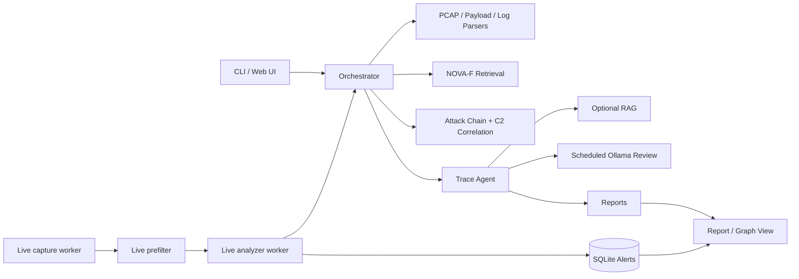

# FlowTragent 架构中文说明

FlowTragent 的目标是把原始流量、payload、日志和检索结果统一到证据驱动的攻击链溯源流程中。系统强调可复现评估、证据分级和低耦合部署，而不是只依赖 CVE 检索结果下结论。

## 系统视图

## 运行入口

- `main.py`：CLI 分析入口，支持 payload、PCAP 和 live 模式。
- `web_app.py`：Flask Web UI/API，提供上传、报告、告警、健康检查和 metrics。
- `scripts/live_capture_worker.py`：持续抓包并写入 live incoming 目录。
- `scripts/live_analyzer_worker.py`：监听 live PCAP，执行预过滤、限流、深度分析和告警入库。
- `scripts/install.sh`：Linux/WSL 一键部署脚本。
- `docker-compose.yml`：Web、analyzer、capture 三服务 Compose 入口。

## 模块职责

- `src/parser/`：PCAP、HTTP payload 和多源日志解析。
- `src/core/`：NOVA client、rerank、配置、结构化日志等核心基础设施。
- `src/correlation/`：攻击链识别、C2 检测、impact verdict 和证据图谱。
- `src/agent/`：组织检索、证据和分析上下文，形成最终研判。
- `src/live/`：实时预过滤、profile 和限流策略。
- `src/storage/`：alert SQLite 存储、去重和跨窗口合并。
- `src/notification/`：Webhook 通知与抑制。
- `src/report/`：JSON/Markdown 报告和图谱输出。

## 分析流水线

1. 输入 payload、PCAP 或日志。
2. 解析为统一事件抽象。
3. 调用 NOVA-F 检索 CVE 候选。
4. 使用 marker、规则和相似度进行 rerank 与低分抑制。
5. 识别攻击链阶段、C2 行为和端点/应用补充证据。
6. 生成 impact verdict、confidence drivers/reducers 和 evidence graph。
7. 输出报告，并在 live 模式下写入告警库和通知通道。

## 证据原则

检索结果不能直接推导为成功利用。系统会区分：

- 已观察证据
- 未观察证据
- 置信度增强因素
- 置信度降低因素
- CVE support level
- impact verdict

HTTP 4xx、缺失响应、缺少端点证据等情况会降低成功利用判断。

## 部署边界

运行产物默认位于 `logs/`、`reports/`、`data/live/`、`data/index/`、`data/tmp/` 等目录。这些目录不应提交到 Git。真实 PCAP、原始 DataCon 数据、模型权重和私有 embedding 也不应进入仓库。

## 扩展方向

- 用完整 DataCon 数据集构建 10,000+ 样本索引。
- 接入更多 Zeek/Suricata 字段和 SIEM 数据源。
- 扩展检测规则为插件化规则包。
- 与 MISP、Wazuh、企业 Webhook 或工单系统集成。
- 建立真实环境 benchmark 和持续质量门禁。
